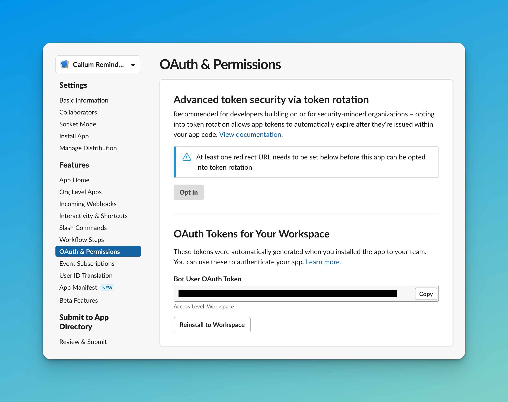
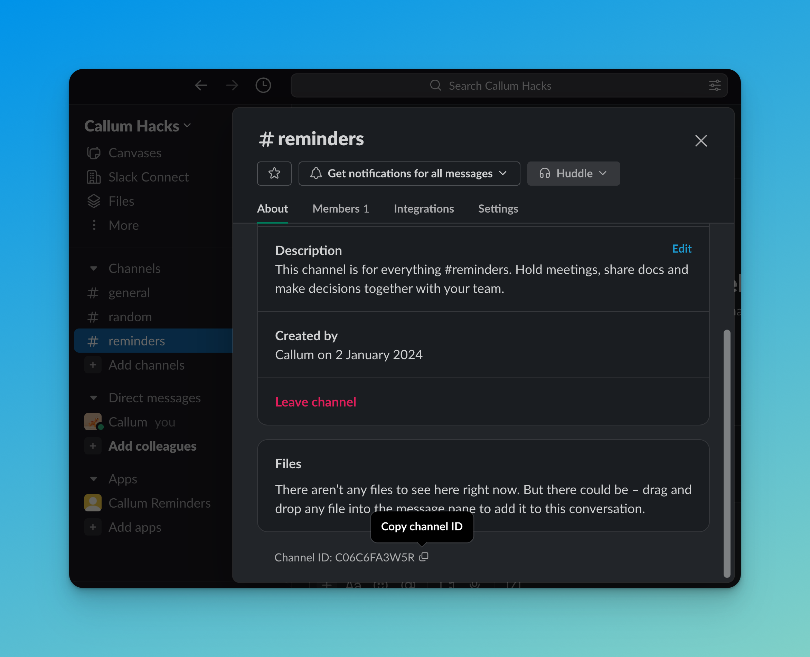
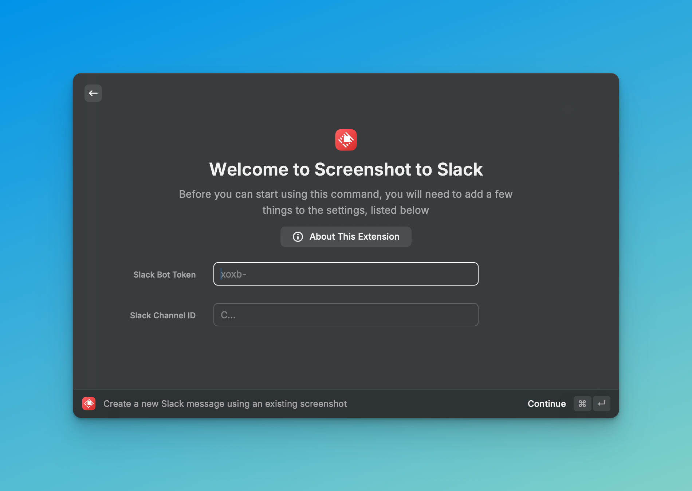

# Screenshot to Slack

This repo contains a [Raycast](https://www.raycast.com/) extension that allows
you to take a screenshot and immediately send it to a Slack channel.

## Demo

https://github.com/mcintyre94/screenshot-to-slack/assets/1711350/bd1f1f99-7490-453a-89f1-4bad26aabf74

## Configuration

- You will need to create a Slack bot on the workspace that you want to send
  messages to. Save its `xoxb-` bot token:
  

- Make sure you invite your bot to the channel you want to send messages to. You
  can do that by just `@` messaging it in that channel.

- Copy the ID of the channel you want to send messages to, which you can see on
  its page in the Slack UI:
  

- Open the "Create a new Slack message using an existing screenshot" command to
  set the bot token and channel ID in preferences:
  

- Now you can use the "Take a new screenshot to send to Slack" command to take a
  screenshot and send it to your chosen Slack channel

- To send an existing image, you can use the "Create a new Slack message using
  an existing screenshot" command
